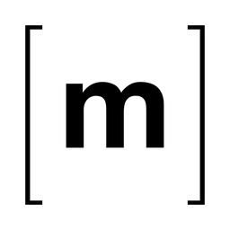

  

  &nbsp;
  &nbsp;
  &nbsp;
  &nbsp;
  

Unraid <b>Community Applications</b> templates for all of junkerderprovinz's containers — both <b>own-image</b> apps (Krusader, JDownloader, Matrix, featherdrop) and <b>upstream-image</b> wrappers (OpenHands, Standard Notes, n8n). One repository, one CA feed; each app's image and full source live in its own per-app repository.

## Templates

### Own-image apps

*Built and published by junkerderprovinz — each has its own image repository.*

#### Krusader

Twin-pane KDE file manager with a native dark theme, on a fast KasmVNC web desktop (Kate, krename, RAR).

**[→ Krusader README](krusader/README.md)**

 

#### JDownloader

JDownloader 2 with a complete, sleek dark UI out of the box, on a KasmVNC web desktop.

**[→ JDownloader README](jdownloader/README.md)**

 

#### Matrix

All-in-one Matrix homeserver: Synapse + coturn + Element Web + Synapse-Admin in one container.

**[→ Matrix README](matrix/README.md)**

 

#### featherdrop

A clean, login-free self-hosted file sharer — drop a file, set an expiry, share a link.

**[→ featherdrop README](featherdrop/README.md)**

 

### Upstream-image wrappers

*Templates for third-party images (no custom build).*

#### OpenHands

Open-source AI software-development agent, pre-wired for a local Ollama model.

**[→ OpenHands README](openhands/README.md)**

 

#### Standard Notes Server

Self-hosted Standard Notes sync server (external MariaDB + Redis). Includes an optional **LocalStack** template for S3-compatible file storage.

**[→ Standard Notes Server README](standardnotes-server/README.md)**

 

#### Standard Notes Web UI

The official Standard Notes web client.

**[→ Standard Notes Web UI README](standardnotes-webui/README.md)**

 

#### n8n

Workflow automation — connect 400+ apps and APIs. PostgreSQL by default, every option exposed in the template form.

**[→ n8n README](n8n/README.md)**

 

> Each app's `icon.png` above is the icon shown in Community Applications.

## Install

On Unraid: open **Apps** (Community Applications) and search for the app name — these templates are published from this repository.

To add a single template by hand, paste its raw `*.xml` URL into **Add Container → Template**, e.g.
`https://raw.githubusercontent.com/junkerderprovinz/unraid-docker-templates/main/openhands/openhands.xml`

Each app folder has its own README with full details and a link to its Unraid support thread.

## License

[MIT](LICENSE)
