

  <picture>
    <source media="(prefers-color-scheme: dark)" srcset=".github/assets/banner-dark.png">
    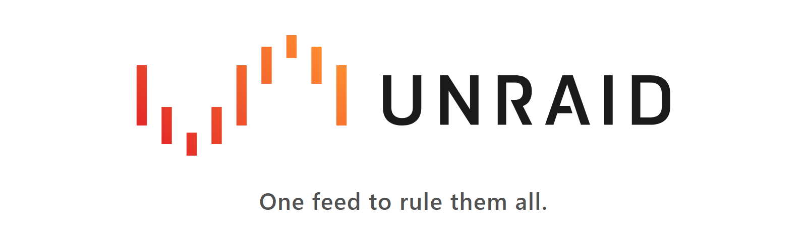
  </picture>

  &nbsp;
  &nbsp;
  &nbsp;
  &nbsp;
  

Unraid <b>Community Applications</b> templates for all of junkerderprovinz's containers and plugins, grouped like the profile: <b>Apps</b> (my own software), <b>Images</b> (my own image builds of third-party apps), <b>Wrappers</b> (thin templates over an upstream image) and <b>Plugins</b>. One repository, one CA feed; each app's image and full source live in its own per-app repository.

## Apps

*My own software, built and published by junkerderprovinz — full docs live in each app's own repository.*

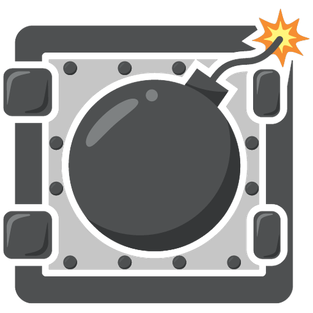

**BombVault** 
Backup and full disaster recovery for containers, VMs and the flash, powered by restic, with one-click backup and cross-server restore.

 

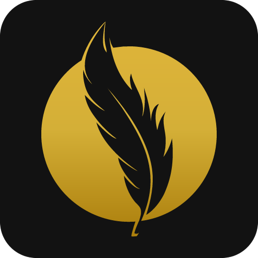

**featherdrop** 
Your own private WeTransfer: feather-light, login-free, end-to-end encrypted file sharing with self-expiring share links.

 

## Images

*My own custom image builds of third-party apps — full docs in each app's own repository.*

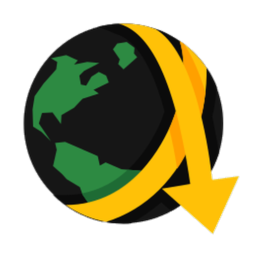

**JDownloader** 
JDownloader 2 with a complete, sleek dark UI out of the box, on a fast Selkies web desktop in your browser — no VNC client, no install.

 

**Krusader** 
Twin-pane KDE file manager with a native dark theme on a fast Selkies web desktop, with Kate, krename and RAR built in.

 

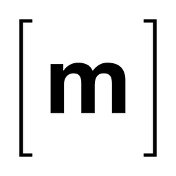

**Matrix** 
All-in-one Matrix homeserver in one container: Synapse, coturn, Element Web and the Ketesa admin UI, with optional TURN over TLS and opt-in QR code device linking.

 

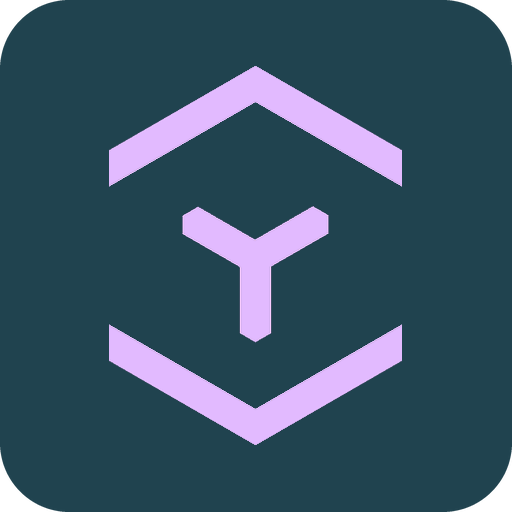

**OpenCloud** 
One-click OpenCloud file sync &amp; share: auto-runs init, heals appdata permissions and honours PUID/PGID.

 

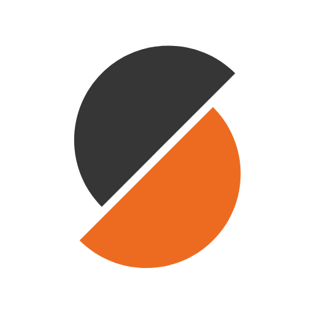

**PrusaSlicer** 
The PrusaSlicer 3D-printing slicer in your browser on a fast Selkies web desktop — slice and export G-code, no VNC client (amd64 + arm64).

 

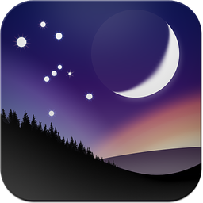

**Stellarium** 
The Stellarium planetarium in your browser on a fast Selkies web desktop — pan the sky, zoom a nebula, scrub through time, no VNC client.

 

## Wrappers

*Thin templates over a third-party upstream image (no custom build) — full docs in each app's folder below.*

**CouchDB** 
The HTTP/JSON document database behind Obsidian LiveSync, on the official 3.x image with data, config and CORS mapped so they survive a recreate or update.

 

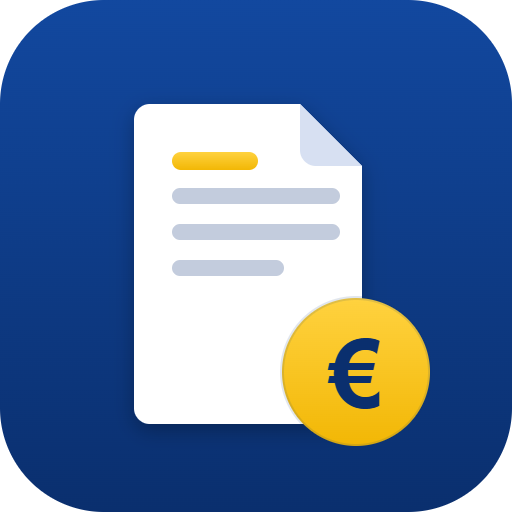

**Euro Office** 
Sovereign, OnlyOffice-compatible document server for browser editing of Office and OpenDocument files, wired into OpenCloud over WOPI.

 

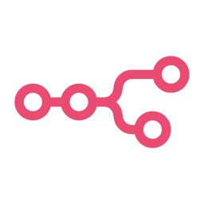

**n8n** 
Workflow automation connecting 400+ apps and APIs, on PostgreSQL by default, with every option exposed in the Unraid template form.

 

**OpenHands** 
Open-source AI software-development agent, pre-wired for a local Ollama model, so it reads, writes and runs code with no cloud account.

 

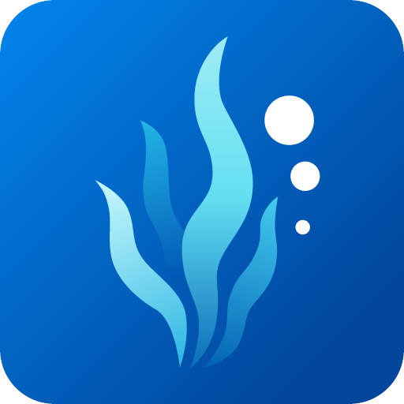

**SeaweedFS** 
Fast, S3-API-compatible object store on the official image, the actively-maintained alternative now that MinIO's open edition is done.

 

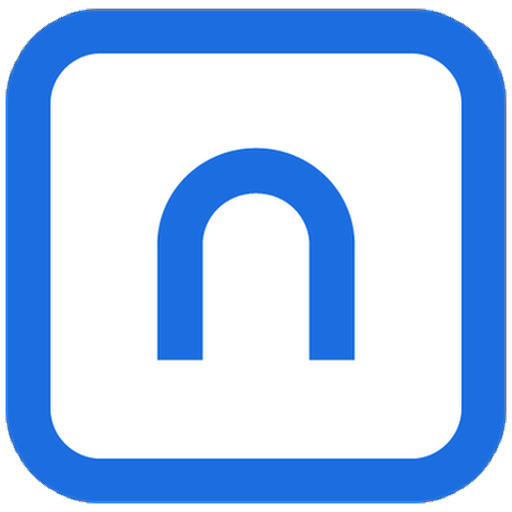

**Standard Notes Server** 
Self-hosted Standard Notes sync server (external MariaDB + Redis), with an optional LocalStack template for S3-compatible storage.

 

**Standard Notes Web UI** 
The official Standard Notes web client, self-hosted next to your own sync server for end-to-end encrypted notes in the browser.

 

## Plugins

*Unraid **plugins** (not containers) — listed on CA, installed from the Plugins tab via a `.plg` URL.*

**BombVault Widget** 
BombVault's activity log as a real, native tile on the Unraid dashboard — every backup, restore, prune and drill live. Requires 6.9.0+.

 

<picture>
  <source media="(prefers-color-scheme: dark)" srcset=".github/readme-icons/shiplog-dark.png">
  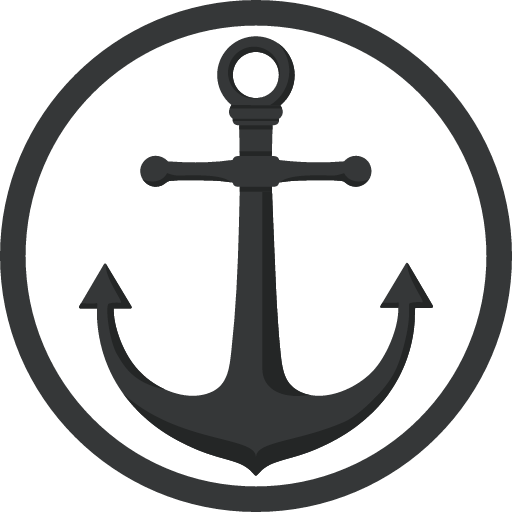
</picture>

**ShipLog** 
Update advisor in Unraid's Docker tab showing what changes and how risky before you update, with optional SemVer-gated auto-update.

 

<picture>
  <source media="(prefers-color-scheme: dark)" srcset=".github/readme-icons/firesquire-dark.png">
  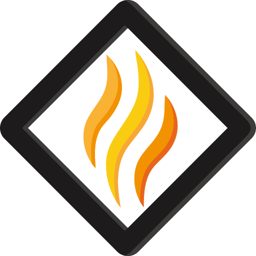
</picture>

**FireSquire** 
A pre-reboot health check returning one clear GO / CAUTION / NO-GO verdict before you reboot, so you never reboot into a landmine.

 

## Install

On Unraid: open **Apps** (Community Applications) and search for the app name — these templates are published from this repository.

To add a single template by hand, paste its raw `*.xml` URL into **Add Container → Template**, e.g.
`https://raw.githubusercontent.com/junkerderprovinz/unraid-apps/main/openhands/openhands.xml`

Apps and Images link to their dedicated repository's README; Wrappers keep their README in their folder here.

**Plugins** (BombVault Widget, ShipLog, FireSquire) are published from this repository too — CA lists them the same way as containers (a template with `<Plugin>True</Plugin>` + `<PluginURL>`), so search for them in **Apps**. You can also install a plugin directly from **Plugins → Install Plugin** with its raw `.plg` URL, e.g.
`https://raw.githubusercontent.com/junkerderprovinz/firesquire/main/plugin/firesquire.plg`

## Support

Everything here is free and open-source. The own-image apps are self-hosted and private by design — no accounts, no telemetry, nothing leaves your server. None of it pays my server bill or the hours that go into it, so if one of these saves you time, money, or a headache, you can [buy me a coffee](https://buymeacoffee.com/junkerderprovinz). Thanks for stopping by.
