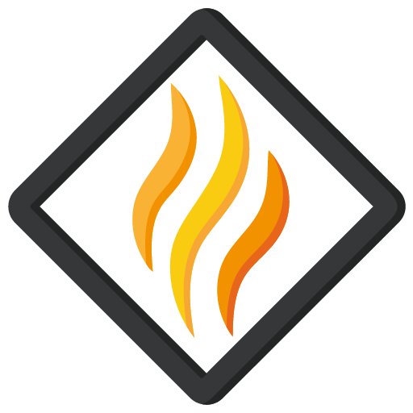

  <picture>
    <source media="(prefers-color-scheme: dark)" srcset=".github/assets/banner-dark.png">
    
  </picture>

  &nbsp;
  &nbsp;
  &nbsp;
  &nbsp;
  

Unraid <b>Community Applications</b> templates for all of junkerderprovinz's containers and plugins, grouped like the profile: <b>Apps</b> (my own software), <b>Images</b> (my own image builds of third-party apps), <b>Wrappers</b> (thin templates over an upstream image) and <b>Plugins</b>. One repository, one CA feed; each app's image and full source live in its own per-app repository.

## Apps

*My own software, built and published by junkerderprovinz — full docs live in each app's own repository.*

**BombVault** 
Backup and full disaster recovery for Docker containers, VMs, the flash USB and any folders you point it at, with
one-click backup, restore from another BombVault server and automatic re-install, all powered by restic.

 

**featherdrop** 
Your own private WeTransfer: feather-light, login-free, end-to-end encrypted self-hosted file sharing where you
drop a file, set an expiry and share a link that quietly deletes itself once it is no longer needed.

 

## Images

*My own container images that package a third-party app on a ready-to-use web desktop — full docs in each app's own repository.*

**JDownloader** 
JDownloader 2 with a complete, sleek dark UI out of the box, running on a fast Selkies web desktop straight in
your browser, so there is no VNC client to install and nothing to set up locally (amd64 + arm64).

 

**Krusader** 
The twin-pane KDE file manager with a native dark theme on a fast Selkies web desktop, with Kate, krename and
RAR support built in, all in your browser with no VNC client and nothing to install locally.

 

**PrusaSlicer** 
The PrusaSlicer 3D-printing slicer running in your browser on a fast Selkies web desktop, so you can slice,
preview and export G-code with no VNC client and no local install at all (amd64 + arm64).

 

**Stellarium** 
The open-source Stellarium planetarium running in your browser on a fast Selkies web desktop, where you can pan
the sky, zoom into a nebula and scrub through time, with no VNC client and no local install (amd64 + arm64).

 

## Wrappers

*Thin templates over a third-party upstream image (no custom build) — full docs in each app's folder below.*

**Euro Office** 
Sovereign European document server (an OnlyOffice-compatible fork) for browser editing of Office and
OpenDocument files, which wires into OpenCloud over WOPI and sits happily behind a reverse proxy.

 

**Matrix** 
An all-in-one Matrix homeserver in a single container: Synapse, coturn, Element Web and Synapse-Admin together,
with optional TURN over TLS, so federation and voice/video calls work out of the box.

 

**n8n** 
Workflow automation that connects 400+ apps and APIs, running on PostgreSQL by default, with every option
exposed directly in the Unraid template form so there is no compose file to edit by hand.

 

**OpenCloud** 
One-click OpenCloud file sync &amp; share: a thin wrapper over the official image that auto-runs init, heals
appdata permissions and honours PUID/PGID, with production and rolling channels (amd64 + arm64).

 

**OpenHands** 
Open-source AI software-development agent, pre-wired for a local Ollama model so it can read, write and run
code on your own box, with no cloud account and no API keys required to get started.

 

**Standard Notes Server** 
Self-hosted Standard Notes sync server (external MariaDB + Redis) for end-to-end encrypted notes, including an
optional LocalStack template for S3-compatible file storage of your attachments.

 

**Standard Notes Web UI** 
The official Standard Notes web client, self-hosted next to your own sync server, so your end-to-end encrypted
notes stay in your browser with no third-party servers ever involved.

 

## Plugins

*Unraid **plugins** (not containers) — listed on CA, installed from the Plugins tab via a `.plg` URL.*

**BombVault Widget** 
BombVault's activity log as a real, native tile on the Unraid dashboard, showing every backup, restore, verify,
prune, off-site run and drill live plus the next scheduled run. Read-only; requires BombVault 6.9.0+.

 

<picture>
  <source media="(prefers-color-scheme: dark)" srcset=".github/readme-icons/shiplog-dark.png">
  
</picture>

**ShipLog** 
An update advisor in Unraid's Docker tab: a per-container bubble showing what changes and how risky it is before
you update, with optional SemVer-gated auto-update plus Ollama summaries and Matrix alerts.

 

<picture>
  <source media="(prefers-color-scheme: dark)" srcset=".github/readme-icons/smokesignal-dark.png">
  
</picture>

**SmokeSignal** 
A pre-reboot health check that returns one clear GO / CAUTION / NO-GO verdict before you reboot, so you never
reboot into a known landmine. Advisory only: it never changes anything on your server by itself.

 

## Install

On Unraid: open **Apps** (Community Applications) and search for the app name — these templates are published from this repository.

To add a single template by hand, paste its raw `*.xml` URL into **Add Container → Template**, e.g.
`https://raw.githubusercontent.com/junkerderprovinz/unraid-apps/main/openhands/openhands.xml`

Apps and Images link to their dedicated repository's README; Wrappers keep their README in their folder here.

**Plugins** (BombVault Widget, ShipLog, SmokeSignal) are published from this repository too — CA lists them the same way as containers (a template with `<Plugin>True</Plugin>` + `<PluginURL>`), so search for them in **Apps**. You can also install a plugin directly from **Plugins → Install Plugin** with its raw `.plg` URL, e.g.
`https://raw.githubusercontent.com/junkerderprovinz/smokesignal/main/plugin/smokesignal.plg`

## Support

Everything here is free and open-source. The own-image apps are self-hosted and private by design — no accounts, no telemetry, nothing leaves your server. None of it pays my server bill or the hours that go into it, so if one of these saves you time, money, or a headache, you can [buy me a coffee](https://buymeacoffee.com/junkerderprovinz). Thanks for stopping by.
