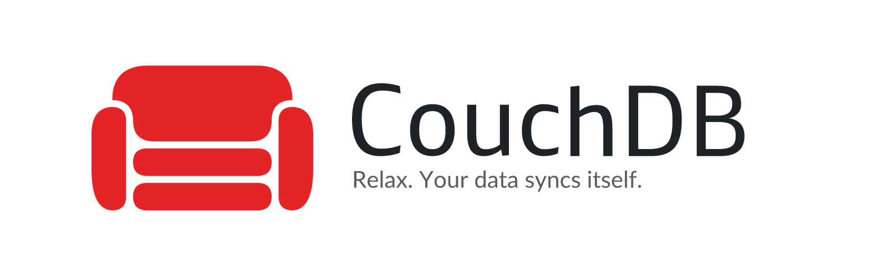

<picture>
  <source media="(prefers-color-scheme: dark)" srcset="assets/banner-dark.png">
  
</picture>

<p align="center">
  <a href="https://github.com/junkerderprovinz/unraid-apps/actions/workflows/validate.yml"></a>&nbsp;
  <a href="https://couchdb.apache.org"></a>&nbsp;
  <a href="https://hub.docker.com/_/couchdb"></a>&nbsp;
  <a href="https://github.com/vrtmrz/obsidian-livesync"></a>&nbsp;
  <a href="https://unraid.net"></a>&nbsp;
  <a href="../LICENSE"></a>
</p>

<p align="center">
A plug-and-play Unraid Community Applications template for <b>Apache CouchDB</b> (3.x) - the
HTTP/JSON document database behind <b>Obsidian LiveSync</b> and many offline-first apps.
Wraps the official <code>couchdb</code> image, fixed so your <b>data and config actually
survive a container recreate or update</b>, with CORS documented for LiveSync.
</p>

<br>

<p align="center">
Maintained solo, in whatever spare time there is. Questions via the <a href="https://forums.unraid.net/topic/198811-support-junkerderprovinz-unraid-apps/">support thread</a>, bugs, ideas and feature requests via <a href="https://github.com/junkerderprovinz/unraid-apps/issues">GitHub issues</a>. If it's useful to you, a coffee is always welcome.
</p>

<p align="center">
  <a href="https://buymeacoffee.com/junkerderprovinz">
    
  </a>
</p>

<br>

## Table of Contents

1. [What is this?](#1-what-is-this)
2. [Why not the old CouchDB template?](#2-why-not-the-old-couchdb-template)
3. [Quick Start on Unraid](#3-quick-start-on-unraid)
4. [First-run setup (single node)](#4-first-run-setup-single-node)
5. [CORS for Obsidian LiveSync](#5-cors-for-obsidian-livesync)
6. [Configuration](#6-configuration)
7. [Backup & restore](#7-backup--restore)
8. [Reverse proxy & HTTPS](#8-reverse-proxy--https)
9. [Updating](#9-updating)
10. [Troubleshooting](#10-troubleshooting)
11. [License](#11-license)
12. [Support this project](#12-support-this-project)

<br>

## 1. What is this?

An **Unraid Community Applications template** for [Apache CouchDB](https://couchdb.apache.org). It
deploys the official [`couchdb`](https://hub.docker.com/_/couchdb) image (currently 3.x) with the
two volume mounts the modern image actually needs, so your databases and settings persist. CouchDB
is a document database that speaks plain HTTP and stores JSON, and it is the standard sync backend
for [Obsidian LiveSync](https://github.com/vrtmrz/obsidian-livesync).

<br>

## 2. Why not the old CouchDB template?

The long-standing community CouchDB template was written for CouchDB **1.x** and maps
`/usr/local/var/lib/couchdb`. The official image has been **3.x** for years, and 3.x stores things
in different places:

| What | CouchDB 3.x path | Old 1.x template |
|---|---|---|
| Databases | `/opt/couchdb/data` | `/usr/local/var/lib/couchdb` (wrong) |
| Config drop-ins | `/opt/couchdb/etc/local.d` | not mapped |

Two things go wrong with the old template:

1. **Your databases live in an anonymous Docker volume.** Because `/opt/couchdb/data` is not mapped,
   the real data sits in an unnamed volume - not in appdata, not in your backups, and **gone the
   moment you recreate or update the container**.
2. **CORS keeps disabling itself.** The image regenerates `local.d/docker.ini` from the admin
   environment variables on **every start**. A restart keeps the file, but a **recreate** wipes any
   CORS you set in Fauxton. Since `local.d` is not mapped, there is nowhere for a persistent CORS
   file to live.

This template maps **both** paths to appdata, so nothing is lost and CORS stays put.

<br>

## 3. Quick Start on Unraid

1. **Apps** tab -> search **CouchDB** (by junkerderprovinz) -> **Install**.
2. Set an **Admin User** and a strong **Admin Password** (CouchDB 3.x will not start without an
   admin; "admin party" is disabled).
3. **Apply**, wait for the pull, then open Fauxton at `http://SERVER_IP:5984/_utils/`.
4. Do the [first-run single-node setup](#4-first-run-setup-single-node) (one command) so the system
   databases exist.
5. Using Obsidian LiveSync or another browser client? Add the
   [CORS file](#5-cors-for-obsidian-livesync).

<br>

## 4. First-run setup (single node)

A fresh CouchDB 3.x node needs its system databases (`_users`, `_replicator`, `_global_changes`)
created once. The cleanest way is the single-node setup call - run it on the Unraid console after
the container is up (replace `SERVER_IP` and `PASSWORD`):

```bash
curl -X POST -u admin:PASSWORD \
  http://SERVER_IP:5984/_cluster_setup \
  -H "Content-Type: application/json" \
  -d '{"action":"enable_single_node","bind_address":"0.0.0.0","username":"admin","password":"PASSWORD","port":5984,"singlenode":true}'
```

Verify it worked:

```bash
curl http://SERVER_IP:5984/_up
curl -u admin:PASSWORD http://SERVER_IP:5984/_all_dbs
```

`_up` should return `{"status":"ok"}` and `_all_dbs` should list `_replicator` and `_users`. The
"`_users` database does not exist" warning in the log is gone once this is done.

<br>

## 5. CORS for Obsidian LiveSync

Browser clients (Obsidian LiveSync, the Obsidian mobile app, any web app) need CORS enabled on
CouchDB. Do **not** set it in Fauxton - that writes to `docker.ini`, which the image regenerates on
the next recreate. Instead add a **separate** drop-in file that the image never touches.

Create `local.d/10-cors.ini` in the config folder you mapped
(`/mnt/user/appdata/couchdb/local.d/10-cors.ini`) with exactly this content:

```ini
[chttpd]
enable_cors = true

[cors]
origins = *
credentials = true
headers = accept, authorization, content-type, origin, referer
methods = GET, PUT, POST, HEAD, DELETE
```

Then restart the container. CORS now survives restarts **and** recreates, because it lives in its
own file that the entrypoint leaves alone.

> **Tighter origins.** `origins = *` is the simplest and works. To lock it down to Obsidian only,
> replace that line with:
> `origins = app://obsidian.md,capacitor://localhost,http://localhost`

In LiveSync, point the **URI** at `http://SERVER_IP:5984` (or your HTTPS domain), enter the admin
user and password, and set a **database name** (LiveSync creates it on first sync). For the mobile
app you generally need **HTTPS** - see [Reverse proxy & HTTPS](#8-reverse-proxy--https).

<br>

## 6. Configuration

Every field is shown in the template. Fields you rarely touch (the cookie secret) are under
**Show more settings**.

| Field | Variable / path | Default | Notes |
|---|---|---|---|
| WebUI / API Port | `5984` | `5984` | HTTP API + Fauxton (`/_utils/`) |
| Data (databases) | `/opt/couchdb/data` | `/mnt/user/appdata/couchdb/data` | the `.couch` files - **must be mapped** |
| Config (local.d) | `/opt/couchdb/etc/local.d` | `/mnt/user/appdata/couchdb/local.d` | drop-in `.ini` (CORS) - **must be mapped** |
| Admin User | `COUCHDB_USER` | `admin` | first start only; change later in Fauxton |
| Admin Password | `COUCHDB_PASSWORD` | - | masked; use a strong one |
| Cookie Secret | `COUCHDB_SECRET` | - | advanced, optional; set for proxy auth / clustering |

Need another CouchDB setting? Either add a variable with Unraid's **Add another Path, Port,
Variable...**, or drop another `.ini` into the mapped `local.d` folder (e.g. `20-tuning.ini`).

<br>

## 7. Backup & restore

Everything that matters is in the two mapped folders under `/mnt/user/appdata/couchdb`:

- **`data/`** - all your databases.
- **`local.d/`** - your config, including `10-cors.ini` and the admin `docker.ini`.

Back up that whole `couchdb` appdata folder (the Unraid **CA Backup** plugin or any file backup
does the job). To restore, drop the folders back and recreate the container. For a logical,
version-independent backup you can also replicate databases out with CouchDB's own
`_replicate`, or dump a database over HTTP.

<br>

## 8. Reverse proxy & HTTPS

CouchDB serves plain HTTP on 5984. The Obsidian mobile app (and good hygiene generally) wants
**HTTPS**, so put it behind a reverse proxy (SWAG / Nginx Proxy Manager / Traefik):

- Proxy `https://couchdb.mydomain.tld` -> `http://SERVER_IP:5984`.
- Point LiveSync's **URI** at the `https://` domain.
- Keep CouchDB itself on the LAN; let the proxy terminate TLS.

CouchDB is a database with a full HTTP API - never expose port 5984 straight to the internet.
Always front it with a proxy and a strong admin password.

<br>

## 9. Updating

CouchDB updates by image: hit **Force Update** in the Unraid Docker tab (or change the `:latest`
tag on the **Repository** field to pin a specific version). Your data and config live in appdata,
so they survive updates. CouchDB 3.x is backward compatible across minor releases; read the
upstream release notes before a major jump.

<br>

## 10. Troubleshooting

<details><summary><b>CORS "keeps turning off" after a recreate</b></summary>

You set CORS in Fauxton, which writes `docker.ini` - the file the image rewrites on every start.
Use a separate `local.d/10-cors.ini` instead (see [CORS](#5-cors-for-obsidian-livesync)). It is
never regenerated.
</details>

<details><summary><b>Log says "the _users database does not exist"</b></summary>

The node has not been finalised. Run the
[single-node setup](#4-first-run-setup-single-node) once.
</details>

<details><summary><b>Container won't start / "you must set the admin"</b></summary>

CouchDB 3.x refuses to run without an admin. Set **Admin User** and **Admin Password** in the
template and Apply.
</details>

<details><summary><b>My databases disappeared after an update</b></summary>

You were on a template that did not map `/opt/couchdb/data`, so the data was in an anonymous
volume. If the container still exists you can recover it: `docker volume ls`, find the volume,
copy its `_data` into `/mnt/user/appdata/couchdb/data`, then recreate on this template. This is
exactly the failure mode this template prevents.
</details>

<details><summary><b>LiveSync can't connect</b></summary>

Check, in order: CORS file present and container restarted; the URI is reachable
(`curl http://SERVER_IP:5984/_up`); admin user/password correct; on mobile, you are using HTTPS
through a reverse proxy.
</details>

<br>

## 11. License

This template is MIT-licensed (see [LICENSE](../LICENSE)). Apache CouchDB itself is a project of
the [Apache Software Foundation](https://couchdb.apache.org), distributed under the
[Apache License 2.0](https://www.apache.org/licenses/LICENSE-2.0); this repo only packages it for
Unraid.

<br>

## 12. Support this project

Questions? Check the [support thread](https://forums.unraid.net/topic/198811-support-junkerderprovinz-unraid-apps/). Bugs, ideas or feature requests? Please [open a GitHub issue](https://github.com/junkerderprovinz/unraid-apps/issues).

This is a one-person project. I put a lot of time and effort into building and maintaining it, in whatever free time I have. If it's helped you, I'd genuinely appreciate the support: you're welcome to buy me a coffee.

<p align="center">
  <a href="https://buymeacoffee.com/junkerderprovinz">
    
  </a>
</p>
