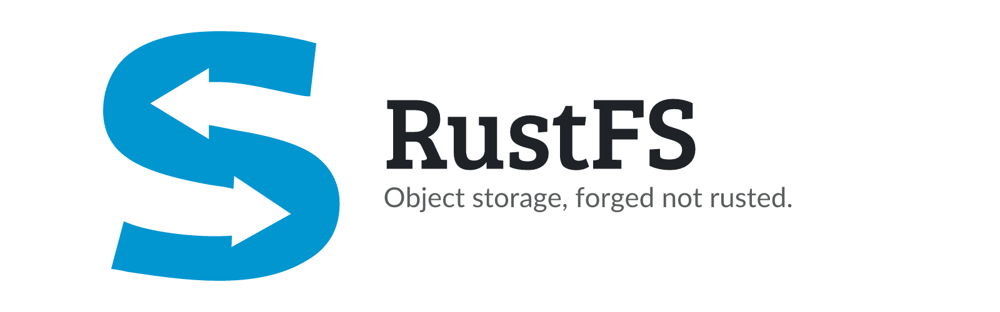

<picture>
  <source media="(prefers-color-scheme: dark)" srcset="assets/banner-dark.png">
  
</picture>

<p align="center">
  <a href="https://github.com/junkerderprovinz/unraid-apps/actions/workflows/validate.yml"></a>&nbsp;
  <a href="https://github.com/rustfs/rustfs"></a>&nbsp;
  <a href="https://hub.docker.com/r/rustfs/rustfs"></a>&nbsp;
  <a href="https://unraid.net"></a>&nbsp;
  <a href="../LICENSE"></a>
</p>

<p align="center">
An Unraid Community Applications template for <b>RustFS</b>, an S3-compatible object store
written in Rust, wrapping the <b>official</b> <code>rustfs/rustfs</code> image with the two
settings it needs to run here at all.
</p>

<p align="center">
<b>This is a pre-release.</b> RustFS has published a hundred releases and not one of them is
stable: alphas, betas and release candidates only. Do not put data here that exists nowhere
else.
</p>

<br>

## Table of Contents

1. [Why this template exists](#1-why-this-template-exists)
2. [Quick start on Unraid](#2-quick-start-on-unraid)
3. [Connecting a client](#3-connecting-a-client)
4. [Configuration](#4-configuration)
5. [How it compares to the other object stores here](#5-how-it-compares-to-the-other-object-stores-here)
6. [Support this project](#6-support-this-project)

<br>

## 1. Why this template exists

Started as it comes, the official image does not run on Unraid. It runs as its own built-in
user id 10001, so on a share owned by `nobody:users` it cannot write and dies during startup:

```
[FATAL] Server runtime failed: Io error: Permission denied (os error 13)
```

This template runs the container as `99:100` instead, which is all it takes. That single
flag is the difference between a container that never starts and one that works.

The second thing it fixes is the credentials. Left alone, RustFS falls back to a built-in
default account that is identical in every copy of the image, and it says so twice in its
own log:

```
Detected default root credentials; set RUSTFS_ACCESS_KEY and RUSTFS_SECRET_KEY
to non-default values for production deployments
```

Here they are required fields, so you cannot start it by accident with the account everyone
else has. Left empty the container stops and says so; only removing the fields entirely
brings the default account back.

<br>

## 2. Quick start on Unraid

Install the template from Community Applications, set an access key and a secret key, and
start it. The Data folder has to be writable by `99:100`, which is the default for anything
under `/mnt/user/appdata`.

A working start runs to a handful of warnings and then goes quiet. There is no "server
is listening" line, so do not wait for one. If you see `Permission denied` instead, the
Data folder is not writable by `99:100`, or you mapped the Logs folder and that one is not.

<br>

## 3. Connecting a client

Point any S3 client at port 9000:

```
Endpoint:   http://<server>:9000
Access key: whatever you set as RUSTFS_ACCESS_KEY
Secret key: whatever you set as RUSTFS_SECRET_KEY
Region:     us-east-1        (any value works)
```

With rclone:

```bash
rclone mkdir rustfs:backups
rclone copy ./file.txt rustfs:backups/
rclone ls rustfs:backups
```

Port 9001 is the built-in web console, which is what the WebUI button opens.

<br>

## 4. Configuration

| Variable | Default | What it does |
| --- | --- | --- |
| `RUSTFS_ACCESS_KEY` | none | The access key your S3 clients use. Required: left empty, the container stops with `RUSTFS_ACCESS_KEY must not be empty`. |
| `RUSTFS_SECRET_KEY` | none | The secret key. Required, same as above. |
| `RUSTFS_CONSOLE_CORS_ALLOWED_ORIGINS` | `*` | Which origins the web console accepts. The image ships with any. |
| `RUSTFS_OBS_LOGGER_LEVEL` | `warn` | error, warn, info, debug or trace. |

The template also sets `--user 99:100` as an extra parameter. Do not remove it.

The Logs folder is deliberately left unmapped. Map it and RustFS writes its log to a
file there, which leaves only three lines in the container log and makes Unraid's log
view close to useless.

<br>

## 5. How it compares to the other object stores here

There are five now, and they solve different problems:

**RustFS** is a plain S3 object store. Objects go in, objects come out, and the folder it
writes to is its own business. Closest in spirit to MinIO, and the reason people are
looking at it.

**[Garage](https://github.com/junkerderprovinz/garage)** is also a plain object store, but
it comes with a web admin panel in the same container and has a stable release behind it.
If you want an object store today and do not need RustFS specifically, this is the one.

**[SeaweedFS](../seaweedfs/README.md)** is the other established one here, built for many
small files and with a long track record.

**[VersityGW](../versitygw/README.md)** is not a store at all, it is a gateway: it puts an
S3 API in front of a share you already have, and every file stays readable over SMB and NFS
at the same time.

**[JuiceFS](https://github.com/junkerderprovinz/juicefs)** splits files into chunks across
a database and an object store. More moving parts, and the data folder is not browsable, in
exchange for a file system that several machines can share.

<br>

## 6. Support this project

Questions, bugs, ideas? **[GitHub issues →](https://github.com/junkerderprovinz/unraid-apps/issues)**.

A one-knight job: I build it, keep it running, work through the issues and add what people ask for, until nothing is missing. It is free, with no accounts, no telemetry, no ads and no paid tier. No asterisk anywhere. Nothing readable ever leaves your own walls. Forged on evenings and weekends, with heart and stubbornness.

If it has earned a place on your server or computer, toss a coin to your knight: it helps cover the costs and keeps the project alive. It also makes this knight's heart beat a little faster. Three ways below, whichever suits you.

<p align="center">
  <a href="https://buymeacoffee.com/junkerderprovinz"></a>
  &nbsp;
  <a href="https://www.paypal.com/donate/?business=UWM4XMNDSUBNN&amp;currency_code=EUR&amp;item_name=RustFS%20for%20Unraid"></a>
  &nbsp;
  <a href="https://junkerderprovinz.github.io/junkerderprovinz/"></a>
</p>
