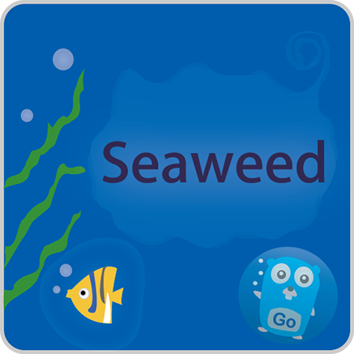

<p align="center">
  
</p>

<h1 align="center">SeaweedFS for Unraid</h1>

<p align="center">
  <a href="https://github.com/junkerderprovinz/unraid-apps/actions/workflows/validate.yml"></a>&nbsp;
  <a href="https://github.com/seaweedfs/seaweedfs"></a>&nbsp;
  <a href="https://hub.docker.com/r/chrislusf/seaweedfs"></a>&nbsp;
  <a href="https://unraid.net"></a>&nbsp;
  <a href="../LICENSE"></a>
</p>

<p align="center">
A plug-and-play Unraid Community Applications template for <b>SeaweedFS</b> - a fast,
S3-API-compatible object store, actively maintained (weekly releases), wrapping the
<b>official</b> <code>chrislusf/seaweedfs</code> image.
</p>

<br>

## Table of Contents

1. [Why this instead of MinIO?](#1-why-this-instead-of-minio)
2. [What is this?](#2-what-is-this)
3. [Quick Start on Unraid](#3-quick-start-on-unraid)
4. [Connecting a client](#4-connecting-a-client)
5. [Coming from MinIO](#5-coming-from-minio)
6. [Configuration](#6-configuration)
7. [Backup](#7-backup)

## 1. Why this instead of MinIO?

MinIO's open-source Community Edition is done: the [`minio/minio` repo was archived in April 2026](https://github.com/minio/minio), its last Docker Hub image (September 2025) has a known unpatched high-severity CVE, and the last source release ever cut (October 2025, source-only, never packaged as an image) was the final one. MinIO now pushes **AIStor** instead - a free tier exists, but it is closed-source, not a continuation of the open MinIO you used to run.

SeaweedFS is a genuine, actively-developed alternative: Apache-2.0, near-weekly releases, an official multi-arch image actually being maintained, and a documented single-node S3 mode that isn't a cut-down fallback - it's the same binary a real cluster uses, just running every role in one process.

## 2. What is this?

SeaweedFS's own ["mini" mode](https://github.com/seaweedfs/seaweedfs#quick-start-with-weed-mini) runs master, volume server, filer, S3 API and admin UI together in a single process, all data under one directory. This template wraps the official image running exactly that mode, with the data directory mapped to Unraid appdata so it survives recreation and updates - nothing more added, nothing hidden.

File ownership inside the data volume is fixed automatically by the image's own entrypoint (a built-in `seaweed` user, `chown`ed on start) - there's no PUID/PGID to configure.

## 3. Quick Start on Unraid

1. Install from Community Applications, or add this template's URL directly:
   `https://raw.githubusercontent.com/junkerderprovinz/unraid-apps/main/seaweedfs/seaweedfs.xml`
2. Set **Access Key** and **Secret Key** (see Security note below) - anything reasonably random works, e.g. generate a secret with `openssl rand -hex 24`.
3. Optionally set **Pre-create Bucket** to a name (or comma-separated names) you want to exist immediately.
4. Start the container. The S3 endpoint is `http://SERVER_IP:8333`; the admin UI (bucket/volume/topology browser) is at `http://SERVER_IP:23646`.

**Security:** leaving both keys empty starts the S3 API in unauthenticated "Allow All" mode. That's fine for a five-minute local test, not for anything you actually care about - set both before storing real data, and don't expose port 8333 to the internet without a reverse proxy and TLS in front of it.

## 4. Connecting a client

Any S3-compatible tool works. A few common ones:

**rclone** (`rclone config`, or a config file entry):
```ini
[seaweedfs]
type = s3
provider = Other
access_key_id = YOUR_ACCESS_KEY
secret_access_key = YOUR_SECRET_KEY
endpoint = http://SERVER_IP:8333
```

**MinIO Client (`mc`)** - yes, the CLI tool still works fine against SeaweedFS:
```bash
mc alias set seaweedfs http://SERVER_IP:8333 YOUR_ACCESS_KEY YOUR_SECRET_KEY
mc mb seaweedfs/my-bucket
mc cp somefile.txt seaweedfs/my-bucket/
```

**restic** (repository URL):
```bash
export AWS_ACCESS_KEY_ID=YOUR_ACCESS_KEY
export AWS_SECRET_ACCESS_KEY=YOUR_SECRET_KEY
restic -r s3:http://SERVER_IP:8333/my-restic-repo init
```

## 5. Coming from MinIO

There is no automatic import - copy your data across with any S3-to-S3 tool. `rclone` is the simplest:

```bash
rclone config   # add both the old MinIO and this SeaweedFS instance as remotes
rclone sync minio-remote:my-bucket seaweedfs-remote:my-bucket --progress
```

`mc mirror` works the same way if you'd rather stay in the MinIO Client tool (it talks to any S3-compatible endpoint, including SeaweedFS, on both sides).

Point whatever was using the old endpoint (backup tools, apps, scripts) at the new `http://SERVER_IP:8333` and the new Access/Secret Key once the copy is verified.

## 6. Configuration

| Setting | Container Variable | Default | Notes |
|---|---|---|---|
| S3 API Port | (port) | `8333` | The functional endpoint every client connects to. |
| Admin UI Port | (port) | `23646` | Browser UI: buckets, volume/cluster status. |
| Master UI Port | (port) | `9333` | Advanced. Master node status page. |
| Filer UI Port | (port) | `8888` | Advanced. Browsable file listing (filer view, not S3 buckets). |
| Data | (path) | `/mnt/user/appdata/seaweedfs/data` | Everything lives here - volumes, filer metadata, admin config. Must be mapped. |
| Access Key | `AWS_ACCESS_KEY_ID` | *(empty)* | S3 access key. Empty + empty secret = unauthenticated mode. |
| Secret Key | `AWS_SECRET_ACCESS_KEY` | *(empty)* | S3 secret key. |
| Pre-create Bucket | `S3_BUCKET` | *(empty)* | Comma-separated bucket name(s) to create on first start. |

## 7. Backup

Everything lives under the single Data mount (`/mnt/user/appdata/seaweedfs/data` by default) - back that up the same way you back up any other appdata folder (e.g. with a container-aware backup tool). There's no separate database or config store to remember.

---

Questions, bugs, ideas? **[Unraid support thread →](https://forums.unraid.net/topic/198811-support-junkerderprovinz-unraid-apps/)** (or open a [GitHub issue](https://github.com/junkerderprovinz/unraid-apps/issues)).
