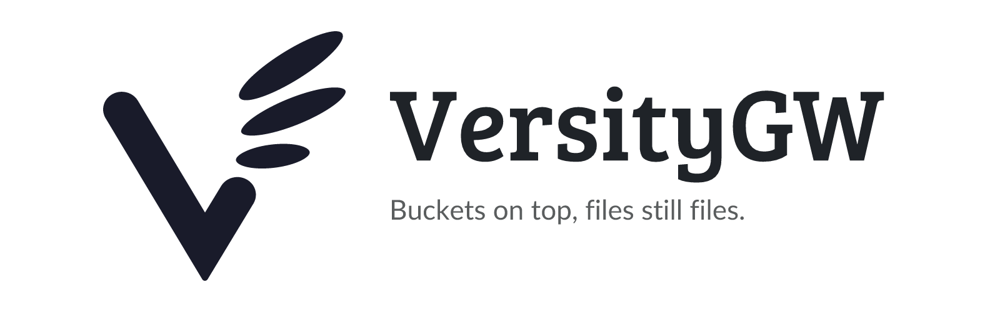

<picture>
  <source media="(prefers-color-scheme: dark)" srcset="assets/banner-dark.png">
  
</picture>

<p align="center">
  <a href="https://github.com/junkerderprovinz/unraid-apps/actions/workflows/validate.yml"></a>&nbsp;
  <a href="https://github.com/versity/versitygw"></a>&nbsp;
  <a href="https://hub.docker.com/r/versity/versitygw"></a>&nbsp;
  <a href="https://unraid.net"></a>&nbsp;
  <a href="../LICENSE"></a>
</p>

<p align="center">
A plug-and-play Unraid Community Applications template for <b>VersityGW</b>, the Versity S3
Gateway - an S3 API in front of a folder you already have, wrapping the <b>official</b>
<code>versity/versitygw</code> image.
</p>

<p align="center">
Maintained solo, in whatever spare time there is. Questions via the <a href="https://forums.unraid.net/topic/198811-support-junkerderprovinz-unraid-apps/">support thread</a>, bugs, ideas and feature requests via <a href="https://github.com/junkerderprovinz/unraid-apps/issues">GitHub issues</a>. If it's useful to you, a coffee is always welcome.
</p>

<p align="center">
  <a href="https://buymeacoffee.com/junkerderprovinz"></a>
  &nbsp;
  <a href="https://www.paypal.com/donate/?hosted_button_id=76FVV52TKXTUS"></a>
  &nbsp;
  <a href="https://junkerderprovinz.github.io/junkerderprovinz/"></a>
</p>

<br>

## Table of Contents

1. [What is this?](#1-what-is-this)
2. [Why this instead of SeaweedFS or Garage?](#2-why-this-instead-of-seaweedfs-or-garage)
3. [Quick Start on Unraid](#3-quick-start-on-unraid)
4. [Connecting a client](#4-connecting-a-client)
5. [What a gateway can and cannot do](#5-what-a-gateway-can-and-cannot-do)
6. [Configuration](#6-configuration)
7. [More accounts than the root user](#7-more-accounts-than-the-root-user)
8. [How AI is used here](#8-how-ai-is-used-here)
9. [Support this project](#9-support-this-project)

## 1. What is this?

Point it at a share and every file in that share is an S3 object. A top-level folder is a
bucket, the files inside it are the objects, and the bytes never move: the same file stays
readable over SMB and NFS while an S3 client is talking to it.

That is the whole idea. The gateway translates S3 requests into ordinary file operations on
a POSIX filesystem, which on Unraid is your array or a pool. Nothing is imported, nothing is
converted, and nothing is duplicated.

It is Apache-2.0, written in Go by [Versity](https://www.versity.com/), and released about
once a month.

## 2. Why this instead of SeaweedFS or Garage?

They answer a different question. SeaweedFS and Garage are object stores: they bring their
own storage layout, and the data inside it is theirs. That is the right answer when you want
replication, erasure coding or a cluster.

This is the right answer when the files already exist and you want to keep reading them the
way you always have. A photo in `/mnt/user/pictures` stays a photo in `/mnt/user/pictures`.
Your backup tool, your app, your script can reach it over S3, and Krusader, a share mount or
`ls` still see the same file. Put an object store in front of the same data and you would
have two copies and one of them unreadable outside the store.

Rough guide:

| You want | Take |
|---|---|
| S3 access to files you already have, still readable as files | VersityGW |
| A real object store with replication across machines | Garage |
| A fast single-node object store, cluster-ready later | SeaweedFS |

## 3. Quick Start on Unraid

1. **Apps** and search for **VersityGW**, then install.
2. Set **Data** to the share you want to expose. `/mnt/user/` exposes every share, one bucket
   per share. A single share like `/mnt/user/backups` makes its subfolders the buckets.
3. Pick a **Root Access Key** and a **Root Secret Key**. Anything goes, they are yours; treat
   the secret like a password.
4. Leave **Accounts** on `/mnt/user/appdata/versitygw`.
5. Start it. The S3 endpoint is `http://<tower-ip>:7070`, the web interface
   `http://<tower-ip>:7071`.

A bucket has to exist before an object can go in it. Either create it from an S3 client, or
create a folder under the mapped path and it is a bucket.

## 4. Connecting a client

Anything that speaks S3 works. Three that come up most often:

**AWS CLI**

```sh
aws --endpoint-url http://tower:7070 s3 ls
aws --endpoint-url http://tower:7070 s3 cp file.txt s3://backups/
```

with `~/.aws/credentials` holding your root access key and secret key.

**rclone**

```ini
[versity]
type = s3
provider = Other
endpoint = http://tower:7070
access_key_id = <your access key>
secret_access_key = <your secret key>
region = us-east-1
```

**A backup tool** (restic, Duplicati, Kopia and the rest): choose S3, endpoint
`http://tower:7070`, bucket name, the two keys. Nothing else is special about it.

If a client insists on virtual-host style addressing (`bucket.tower:7070`), switch it to path
style. Everything here is path style.

## 5. What a gateway can and cannot do

**It can** serve existing files as objects, keep POSIX and S3 access working side by side,
hold multiple accounts with their own keys, and stay out of the way when you write files the
ordinary way.

**It cannot** invent what the filesystem does not have. Object versioning, lifecycle rules and
cross-region replication belong to a real object store; a folder has no version history. If
you need those, you want Garage or SeaweedFS instead, and that is not a shortcoming of this
one.

**A caution about writing from both sides.** A file changed over SMB while an S3 client is
reading it is exactly as safe, or unsafe, as two SMB clients doing the same thing. The
gateway adds no locking of its own.

## 6. Configuration

| Setting | Default | What it does |
|---|---|---|
| **Data** | `/mnt/user/` | The folder served as S3. Top-level subfolders are buckets. |
| **Accounts** | `/mnt/user/appdata/versitygw` | Where accounts other than root are stored. |
| **Root Access Key** | - | The root S3 access key. Required. |
| **Root Secret Key** | - | The root S3 secret key. Required, masked in the template. |
| **S3 API** | `7070` | The S3 endpoint port. |
| **Web Interface** | `7071` | Browser interface. Clear the address variable to switch it off. |
| **Admin API** | `7080` | Account administration. The web interface needs it. |
| **Region** | `us-east-1` | The region string the gateway answers with. Client and gateway just have to agree. |
| **Health Path** | `/_health` | A GET here answers without credentials, for a monitor or a proxy. |

The advanced variables (`VGW_BACKEND`, `VGW_BACKEND_ARG`, the listen addresses) exist because
the image is driven by environment variables rather than a config file. They are set correctly
for the POSIX case and only need touching if you switch the gateway to an S3, Azure or ScoutFS
backend, which the upstream
[documentation](https://github.com/versity/versitygw/wiki) covers.

## 7. More accounts than the root user

The root keys are meant for administration, not for handing to every app. The gateway carries
a built-in account store, which is what the **Accounts** mapping is for: create an account per
tool, each with its own keys, and revoke one without touching the others.

Do it in the web interface, or over the admin API with the upstream `versitygw admin` command.
Without the Accounts mapping every account except root is gone on the next restart, which is
the one mistake worth avoiding here.

## 8. How AI is used here

One knight builds this, and AI is one of the tools I work with, the same way I work with an editor or a compiler. It helps me write code and documentation and it checks my work, and that saves me a good many evenings. It does not make the decisions, though. I read and understand everything before it ships, and if something here breaks, that is on me and not on the tool.

You do not have to take my word for it. The code is open and every release note is written by hand. The issue tracker shows how problems actually get handled, including the ones I got wrong the first time. If you find something that is not right, open an issue and I will look at it.

<br>

## 9. Support this project

<p align="center">
  <a href="https://buymeacoffee.com/junkerderprovinz"></a>
  &nbsp;
  <a href="https://www.paypal.com/donate/?hosted_button_id=76FVV52TKXTUS"></a>
  &nbsp;
  <a href="https://junkerderprovinz.github.io/junkerderprovinz/"></a>
</p>

<p align="center">
The gateway itself is <a href="https://github.com/versity/versitygw">Versity's</a> work,
Apache-2.0. What is maintained here is the Unraid template and this page.
</p>
